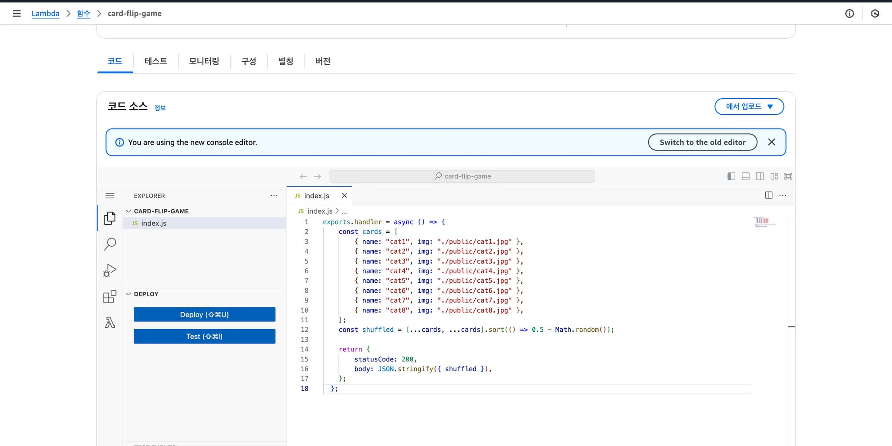
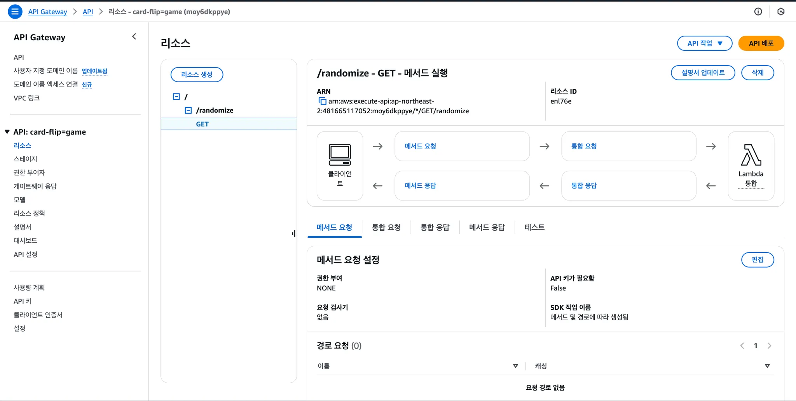
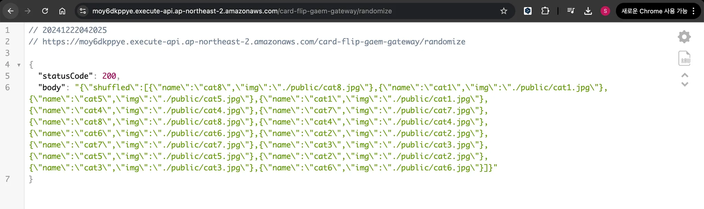
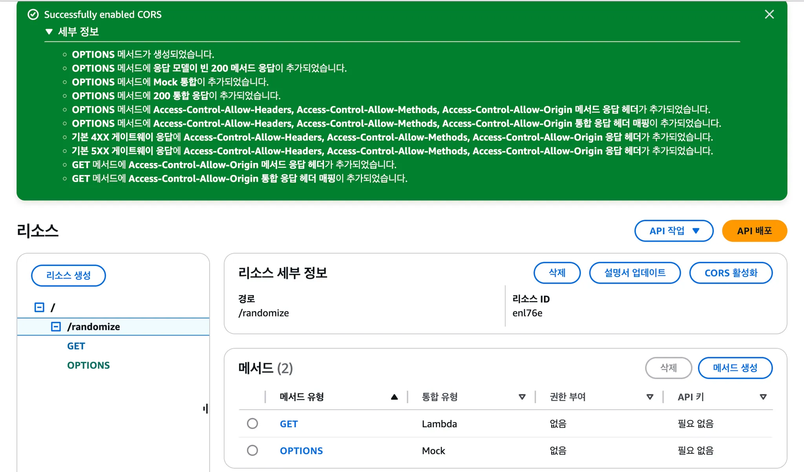

# 1. 프로젝트 소개

## 1.1 프로젝트 설명

이 프로젝트는 간단한 카드 맞추기 게임을 로컬 개발 환경에서 클라우드 환경으로 마이그레이션하는 것을 목표로 합니다.

카드 맞추기 게임은 HTML, CSS, JavaScript로 작성된 간단한 게임입니다. 8개의 쌍으로 이루어진 16개의 카드가 게임 보드에 생성되고 모든 카드 쌍을 맞추면 게임이 종료됩니다. 게임을 다시 시작 할 때마다 카드의 위치는 무작위로 초기화됩니다. 게임이 끝나면 게임을 실행하는데 걸린 시간을 표시해줍니다.

### 1.1.1 프로젝트 구조

```bash
.
├── index.css
├── index.html
├── index.js
└── public
    ├── cat1.jpg
    ├── cat2.jpg
    ├── cat3.jpg
    ├── cat4.jpg
    ├── cat5.jpg
    ├── cat6.jpg
    ├── cat7.jpg
    ├── cat8.jpg
    └── scg.png
```

### 1.1.2 프로젝트 실행 화면

<table>
    <tr>
        <td></td>
        <td></td>
        <td></td>
    </tr>
</table>

# 2. 서버리스로 구현한 부분

## 2.1 기능 분리

기존의 프로젝트 구조는 HTML, CSS, JS로 이루어진 단순한 정적 웹 사이트로, Lambda를 사용하기에 적합한 구조가 아니었습니다. 따라서 `index.js`의 “카드 셔플” 기능을 아래와 같이 분리해서 사용했습니다.

```jsx
exports.handler = async () => {
  const cards = [
    { name: "cat1", img: "./public/cat1.jpg" },
    { name: "cat2", img: "./public/cat2.jpg" },
    { name: "cat3", img: "./public/cat3.jpg" },
    { name: "cat4", img: "./public/cat4.jpg" },
    { name: "cat5", img: "./public/cat5.jpg" },
    { name: "cat6", img: "./public/cat6.jpg" },
    { name: "cat7", img: "./public/cat7.jpg" },
    { name: "cat8", img: "./public/cat8.jpg" },
  ];
  const shuffled = [...cards, ...cards].sort(() => 0.5 - Math.random());

  return {
    statusCode: 200,
    body: JSON.stringify({ shuffled }),
  };
};
```

## 2.2 S3를 이용해 프론트엔드 배포

서버리스 구조를 위해 EC2 대신 S3를 이용해 정적 파일을 배포했습니다. Bucket에 파일을 업로드 하고 Static Website Hosting을 활성화했습니다.


## 2.3 Lambda와 API Gateway로 백엔드 배포

### 2.3.1 Lambda 함수 생성

아래와 같이 Node.js 런타임 람다 함수를 생성했습니다.


### 2.3.2 API Gateway 설정

`GET /randomize` 경로로 API를 리소스를 생성하고 람다 함수와 연결했습니다.


아래와 같이 API 게이트웨이를 통해 람다 함수가 호출됨을 확인했습니다.


## 2.4 추가 설정

### 2.4.1 프론트엔드 코드 수정

설정한 API 게이트웨이를 통해 랜덤 생성된 카드 정보를 받아오도록 아래와 같이 프론트엔드 코드를 수정했습니다.

```jsx
// 페이지가 로드 됐을 때 실행되는 함수, 오버라이딩
onload = async () => {
  const start = new Date();
  startTime = start.getTime();

  // 람다로부터 랜덤 카드 결과 받아오기
  const response = await fetch(
    "https://moy6dkppye.execute-api.ap-northeast-2.amazonaws.com/card-flip-gaem-gateway/randomize"
  );
  const data = await response.json();
  const shuffledCards = JSON.parse(data.body).shuffled;

  // cardArray 업데이트
  for (let i = 0; i < cardArray.length; i++) {
    cardArray[i].name = shuffledCards[i].name;
    cardArray[i].img = shuffledCards[i].img;
  }

  getGameDOM();
  cardArray.sort(() => 0.5 - Math.random());
  setIDtoCardArray();
  createBoard();
  setTimeout(backFlipAll, 3000);
};
```

### 2.4.2 CORS 활성화

프론트엔드에서 백엔드 API를 호출하기 위해 CORS 설정을 추가했습니다.



# 3. 서버리스 컴퓨팅의 장점

## 3.1 유지보수 간소화

서버리스 아키텍처에서는 개발자가 서버를 직접 관리할 필요가 없습니다. AWS Lambda는 인프라를 자동으로 관리하며, 운영 체제 업데이트나 보안 패치 작업을 AWS에서 처리해줍니다. 이러한 특성 덕분에 이번 프로젝트에서도 추가적인 서버 관리 작업 없이 Lambda 함수 작성과 API Gateway 설정만으로 원하는 기능을 구현할 수 있었습니다.

## 3.2 빠른 개발 및 배포

서버리스 컴퓨팅은 개발자들이 애플리케이션 로직에만 집중할 수 있도록 도와줍니다. 이번 프로젝트에서는 Lambda와 API Gateway를 사용해 몇 번의 클릭만으로 REST API를 생성하고 배포할 수 있었으며, 이는 전통적인 서버 기반 환경과 비교했을 때 훨씬 빠른 구현이 가능했습니다.

## **3.3 확장성과 비용 효율성**

서버리스 컴퓨팅은 트래픽 증가나 감소에 따라 자동으로 리소스를 조정하여 확장성을 제공합니다. 이를 통해 예측하기 어려운 트래픽 변화에도 유연하게 대응할 수 있습니다. 또한, 사용한 만큼만 비용이 청구되는 Pay-as-you-go를 통해 불필요한 비용 지출을 줄일 수 있습니다. 이번 프로젝트에서 Lambda를 사용하여 카드 배열을 섞는 기능을 구현했을 때, 매우 적은 실행 시간과 리소스를 사용하여 비용 효율적인 백엔드 구축이 가능함을 확인했습니다.

# 4. 서버리스 선택 시 고려해야 할 요소

## **4.1 사용 사례 적합성**

서버리스는 짧고 간단한 작업에 적합하며, 트래픽 패턴이 일정하지 않거나 스파이크가 있는 경우 특히 유리합니다. 그러나 장시간 실행되거나 지속적인 리소스 점유가 필요한 작업은 비용이 증가할 수 있으므로 서버리스보다 컨테이너나 EC2가 더 적합할 수 있습니다. 이번 프로젝트는 간단한 카드 배열 섞기 기능으로 서버리스 환경에 적합한 사례였습니다.

## **4.2 실행 시간 제한**

AWS Lambda는 최대 실행 시간이 15분으로 제한됩니다. 이 제한은 간단한 작업에는 문제가 없으나, 복잡한 데이터 처리나 머신 러닝 작업에는 적합하지 않을 수 있습니다. 이번 프로젝트에서는 Lambda 함수 실행 시간이 짧았기 때문에 이러한 제한이 문제가 되지 않았습니다.

## **4.3 벤더 종속성**

서버리스 플랫폼은 클라우드 제공자에 종속적이므로, 특정 클라우드 서비스에 의존하게 됩니다. AWS Lambda를 사용하여 작성된 함수는 AWS 환경에 최적화되어 있으며, 다른 클라우드 플랫폼으로 이전하려면 추가적인 작업이 필요합니다. 따라서 장기적으로 클라우드 제공자 간의 비용 비교와 종속성 문제를 고려해야 합니다.

# 5. 서버리스 구조의 단점 및 보완 방안

## **5.1 디버깅과 모니터링의 어려움**

서버리스 컴퓨팅 환경에서는 실행 환경이 추상화되어 있기 때문에 디버깅과 성능 모니터링이 어렵습니다. Lambda 함수의 문제를 찾기 위해 CloudWatch 로그를 확인해야 했으며, 이는 일반적인 로컬 디버깅보다 시간이 더 소요되었습니다. 이를 보완하기 위해 AWS X-Ray와 같은 도구를 활용해 분산 트레이싱을 구현하는 것이 유용할 것입니다.

## **5.2 콜드 스타트 문제**

Lambda 함수는 요청이 없을 때 인스턴스를 종료하고, 새로운 요청이 들어오면 인스턴스를 다시 시작합니다. 이 과정에서 약간의 지연 시간이 발생합니다. 이러한 문제는 빈번한 요청이 예상될 때 Lambda를 일정 수준으로 워밍업 상태로 유지하거나, API Gateway 캐싱 기능을 통해 요청 속도를 향상시켜 보완할 수 있습니다.

# 6. 결과 요약

이번 프로젝트를 통해 서버리스 아키텍처의 강점과 한계를 실감할 수 있었습니다. AWS Lambda와 API Gateway를 사용하여 간단한 카드 배열 섞기 기능을 구현했으며, 이를 통해 서버리스 환경의 유연성, 비용 효율성, 그리고 빠른 배포 속도를 경험할 수 있었습니다. 또한, 서버리스의 주요 단점인 콜드 스타트, 디버깅의 어려움 등을 학습할 수 있는 기회였습니다. 이러한 경험을 바탕으로, 서버리스가 적합한 사용 사례와 그렇지 않은 경우를 구분할 수 있는 실무 감각을 키울 수 있었습니다. 앞으로는 더욱 복잡한 프로젝트에서도 서버리스를 활용할 수 있도록 추가 학습을 진행하고자 합니다.
