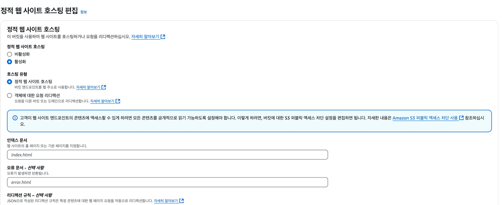

# 1. 프로젝트 소개

## 1.1 프로젝트 설명

이 프로젝트는 간단한 카드 맞추기 게임을 로컬 개발 환경에서 클라우드 환경으로 마이그레이션하는 것을 목표로 합니다.

카드 맞추기 게임은 HTML, CSS, JavaScript로 작성된 간단한 게임입니다. 8개의 쌍으로 이루어진 16개의 카드가 게임 보드에 생성되고 모든 카드 쌍을 맞추면 게임이 종료됩니다. 게임을 다시 시작 할 때마다 카드의 위치는 무작위로 초기화됩니다. 게임이 끝나면 게임을 실행하는데 걸린 시간을 표시해줍니다.

### 1.1.1 프로젝트 구조

```bash
.
├── index.css
├── index.html
├── index.js
└── public
    ├── cat1.jpg
    ├── cat2.jpg
    ├── cat3.jpg
    ├── cat4.jpg
    ├── cat5.jpg
    ├── cat6.jpg
    ├── cat7.jpg
    ├── cat8.jpg
    └── scg.png
```

### 1.1.2 프로젝트 실행 화면

<table>
    <tr>
        <td></td>
        <td></td>
        <td></td>
    </tr>
</table>

# 2. 로컬 개발 vs 클라우드 배포 비교

## 2.1 클라우드 배포

클라우드 배포를 위해 Docker로 프로젝트를 컨테이너화 하고, Git과 GitHub를 통해 파일을 전송했으며, AWS EC2 인스턴스를 통해 배포를 진행했습니다.

### 2.1.1 Docker 파일 작성, GitHub Push

```docker
FROM nginx:alpine
COPY . /usr/share/nginx/html
EXPOSE 80
```

프로젝트에 위와 같이 Dockerfile을 추가하고 아래 깃허브 저장소에 프로젝트를 Push 했습니다.

https://github.com/yesjuhee/aws-migration

### 2.1.2 EC2 인스턴스 생성

AWS에 로그인하여 EC2 인스턴스를 생성하고 네트워크 설정을 했습니다.




### 2.1.3 Instance Shell 접속하여 컨테이너 실행

아래와 같이 명령어를 입력하여 컨테이너를 실행시켜 배포를 완료했습니다.

```bash
sudo apt update
sudo apt install docker.io
git --version
git clone https://github.com/yesjuhee/aws-migration
cd aws-migration
sudo docker build -t card-flipping-game .
sudo docker images
sudo docker run -d -p 80:80 card-flipping-game
```

## 2.2 로컬 개발 vs 클라우드 배포 비교

### 2.2.1 로컬 개발

로컬 환경에서 개발하는 경우 모든 의존성, 파일, 환경 설정이 개발자의 컴퓨터에 존재하여 테스트 및 디버깅 속도가 빠릅니다. 네트워크 설정과 보안 문제에서 비교적 자유롭고, Docker Desktop을 사용해 간단하게 컨테이너 환경을 구성할 수 있어 개발 속도가 빨라질 수 있습니다. 또한, 네트워크 연결 없이 작업할 수 있어 장소의 제약 없이 개발이 가능합니다.

### 2.2.2 클라우드 배포

클라우드 환경은 애플리케이션을 배포 후 원격 접근이 가능하도록 설정할 수 있어 확장성이 우수합니다. AWS와 같은 클라우드 서비스는 자동 백업, 모니터링, 로드 밸런싱 등의 추가 기능을 제공하여, 트래픽 변화에 맞추어 쉽게 인프라를 확장할 수 있습니다. 이러한 클라우드 배포 방식은 특히 사용자 접근성을 높이고 유지 관리 및 보안 설정을 강화하는 데 유리합니다.

# 3. 서버 규모에 따른 클라우드 마이그레이션 분석

이번 프로젝트에서는 소규모 애플리케이션에 적합한 무료 계층 대상 인스턴스인 t2.micro EC2 인스턴스를 선택했습니다. 이 인스턴스는 카드 게임 애플리케이션을 실행하는 데 충분한 자원을 제공합니다. AWS는 애플리케이션의 요구 사항에 따라 서버 크기를 조정할 수 있는 유연성을 제공하여 고정된 로컬 자원과 비교해 이점을 제공합니다. 만약 트래픽이 증가하거나 애플리케이션 요구 사항이 확장된다면 인스턴스를 필요에 맞게 확장할 수 있습니다.

# 4. 보안, 백업, 유지 보수

## 4.1 보안

보안을 위해 포트 80에서 HTTP 트래픽과 포트 22에서 SSH 접근을 허용하는 Custom Security Group을 구성했습니다. Dockerfile은 필수 포트만 노출하도록 구성되어 있으며, AWS의 네트워크 설정을 통해 인스턴스가 권한 있는 채널을 통해서만 접근 가능하도록 설정되었습니다. 이러한 보안 설정은 서버와 애플리케이션을 보호할 수 있습니다.

## 4.2 백업

이번 프로젝트에서는 많은 데이터를 필요로 하지는 않았지만, AWS는 Amazon S3를 통해 데이터와 애플리케이션 파일을 저장할 수 있는 서비스를 제공합니다. 또한 EBS 스냅샷을 통해 EC2 인스턴스의 백업을 생성할 수 있습니다. 이러한 백업은 자동화되어 데이터 손실 방지와 연속성을 보장할 수 있습니다.

## 4.3 유지 보수

유지 관리 작업에는 인스턴스 성능 모니터링, 컨테이너 업데이트 관리, 가용성 보장이 포함됩니다. AWS CloudWatch를 사용하면 서버의 성능 지표를 실시간으로 모니터링하고 성능 문제에 대한 알림을 받을 수 있습니다.

# 5. 결과 요약

이번 프로젝트를 통해 클라우드 배포의 장점으로 확장성, 유지 관리 용이성, 보안성을 배울 수 있었습니다. 클라우드 환경에서는 트래픽에 맞춰 서버 용량을 조절하고, 자동화된 백업 및 복구 기능을 통해 데이터 손실 위험을 줄일 수 있습니다. 또한 AWS에서 제공하는 다양한 보안 설정 옵션을 통해 네트워크 및 접근 제어를 강화할 수 있었습니다. 이러한 특징들은 클라우드가 장기적인 서비스 운영 및 관리에 최적화된 플랫폼임을 보여주며, 로컬 개발과 차별화되는 클라우드 배포의 강점을 실감할 수 있는 기회였습니다.
